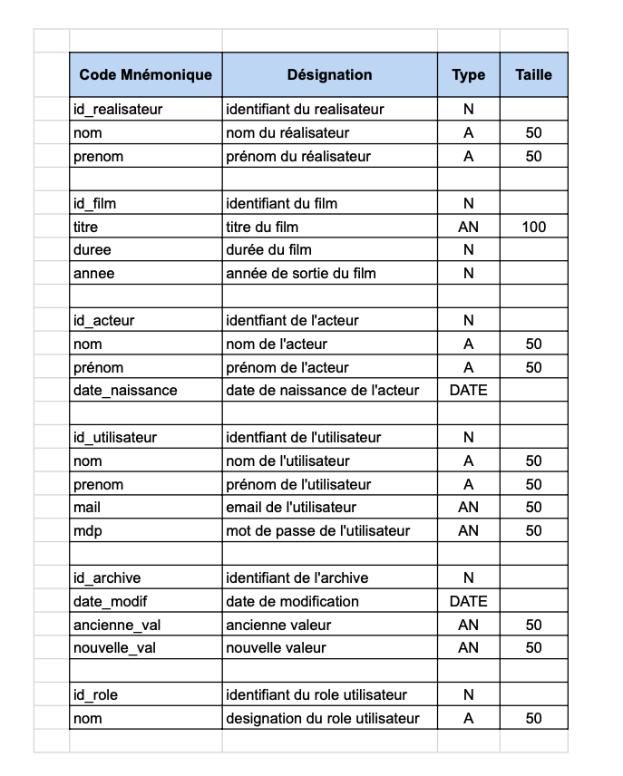
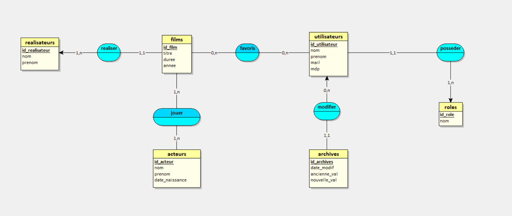
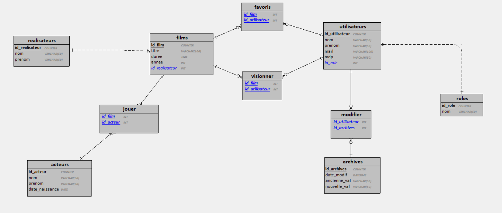
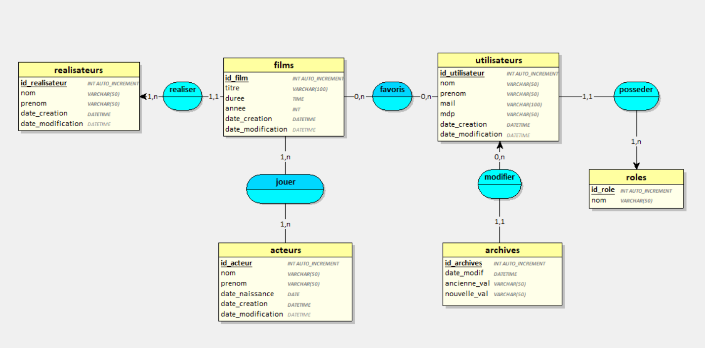

# Plateforme de streaming
## Contexte du projet
En tant que développeur passionné par le cinéma, vous avez toujours été fasciné par la magie du grand écran. Cette passion ne se limite pas seulement à regarder des films. Vous avez toujours été curieux de connaître les coulisses, d'étudier qui a joué dans tel film, qui l'a réalisé, et comment ces chefs-d'œuvre ont été créés. Vous trouvez aussi que les plateformes de streaming sont un formidable accès à un catalogue d'oeuvres de toute sorte à découvrir.
Vous avez donc envie de créer, vous aussi, votre propre plateforme de streaming sur votre temps libre.
Mais comme Rome ne s'est pas construite en un jour, vous voulez commencer par la mise en place d'un site web permettant de procéder à différentes opérations de recherches à propos de films, d'acteurs/actrices ou de réalisateurs.
Sauf que. La partie site web n'est pas pour tout de suite 😃
Avant celà, vous avez besoin d'une base de données pour le stockage. Et donc de la concevoir et la mettre en place!
A vous de jouer 🙂
​
#### Contraintes
- Le noSQL (MongoDB...) n'est pas autorisé
- Vous devez créer votre propre environnement Docker
- Un *trigger* doit être mis en place, également appelé déclencheur

- Seul l'administrateur de la BDD pourra ajouter, modifier ou supprimer des données. 
- Pour chaque entrée dans la base de données, il y aura la date de création et de modification.

#### Deadline
4 jours.

#### Modalités d'évaluation
Correction entre pairs.  
Vos requêtes seront testées en local après l'importation de votre environnemnt docker.

#### Livrables
Un dépôt GitHub contenant :
- l'environnement docker
- le dictionnaire de données
- MCD
- MPD
- MLD
- un fichier permettant de générer la bdd (incluant quelques données)
- le jeu de requêtes dans le *README.md*

# Result

## Dictionnaire de données


## Diagramme 

### MCD 



### MLD 



### MPD 




## HOW TO USE 

```bash
git clone https://github.com/2023-cda-alt-devops-p4/streaming-lp
cd streaming-lp
docker compose up 
```

NB: IF NECESSARY change MYSQL_ROOT_PASSWORD and PORT 

in DBEAVER pass allowPublicKeyRetrieval=TRUE 

use database.sql to create and insert database

## Requete SQL 

- **Les titres et mes dates de sortie des films du plus récent au plus ancien**

```sql
SELECT titre, annee FROM films ORDER BY annee DESC;
```

- **Les noms, prénoms et âges des acteurs/actrices de plus de 50 ans dans l'ordre alphabetique**

```sql
SELECT nom, prenom, date_naissance, 
    YEAR(CURDATE()) - YEAR(date_naissance) AS age 
FROM acteurs
WHERE date_naissance <= DATE_SUB(CURDATE(), INTERVAL 50 YEAR)
ORDER BY nom, prenom;
```

- **La liste des acteurs/actrices principaux pour un film donné (en supposant que l'acteur principal est celui avec le rôle "Acteur Principal")**

```sql
SELECT acteurs.nom, acteurs.prenom, films.titre
FROM acteurs
INNER JOIN jouer ON acteurs.id_acteur = jouer.id_acteur
INNER JOIN films ON jouer.id_film = films.id_film
WHERE jouer.role_acteur = 'Principal'
AND films.titre = 'The Dark Knight'
```

- **La liste des films pour un acteur/actrice donné (en supposant que vous connaissez l'ID de l'acteur/actrice)**

```sql
SELECT films.titre, films.annee
FROM films
INNER JOIN jouer ON films.id_film = jouer.id_film
WHERE jouer.id_acteur = 1;
```

- **Ajouter un acteur/actrice (assumant que vous avez les valeurs pour nom, prenom et date de naissance)**

```sql
INSERT INTO acteurs (nom, prenom, date_naissance)
VALUES ('Nouveau', 'Acteur', '1990-01-01');
```

- **Modifier un film (assumant que vous avez l'ID du film que vous souhaitez modifier et la nouvelle valeur pour le titre)**

```sql
UPDATE films
SET titre = 'Nouveau Titre'
WHERE id_film = 1;
```

- **Supprimer un acteur/actrice assumant que vous avez l'ID de l'acteur/actrice que vous souhaitez supprimer**

```sql
DELETE FROM acteurs
WHERE id_acteur = 1;
```

- **Afficher les 3 derniers acteurs/actrices ajouté(e)s**

```sql
SELECT nom, prenom, date_naissance
FROM acteurs
ORDER BY id_acteur DESC
LIMIT 3;
```

# Critères d'évaluation

- [✔️] OK
- [:x:] NOT OK

*replace check markdown after evaluation*


## Livrables

Un dépôt GitHub contenant :
- [✔️] L'environnement docker
- [✔️] Le dictionnaire de données
- [✔️] MCD
- [✔️] MPD
- [✔️] MLD
- [✔️] Un fichier permettant de générer la bdd (incluant quelques données)
- [✔️] Le jeu de requêtes dans le *README.md*

## Critères de performance

- [✔️] Récupération facile de votre environnement
- [✔️] Exactitude des relations entre les tables
- [✔️] Trigger* mis en place
- [✔️] Bonne présentation des requêtes sur le *README.md*
- [:x:] Exécution des requêtes sans erreur

### Les requêtes

- [✔️] Les titres et dates de sortie des films du plus récent au plus ancien
- [✔️] Les noms, prénoms et âges des acteurs/actrices de plus de 30 ans dans l'ordre alphabétique
- [✔️] La liste des acteurs/actrices principaux pour un film donné
- [✔️] La liste des films pour un acteur/actrice donné
- [✔️] Ajouter un film
- [✔️] Ajouter un acteur/actrice
- [✔️] Modifier un film
- [✔️] Supprimer un acteur/actrice
- [✔️] Afficher les 3 derniers acteurs/actrices ajouté(e)s

### Procédures

- [✔️] Lister grâce à une procédure stockée les films d'un réalisateur donné en paramètre

### Triggers

- [:x:] Garder grâce à un trigger une trace de toutes les modifications apportées à la table des utilisateurs. Ainsi, une table d'archive conservera la date de la mise à jour, l'identifiant de l'utilisateur concerné, l'ancienne valeur ainsi que la nouvelle.
- [✔️] Pour chaque entrée dans la base de données, il y aura la date de création et de modification.
